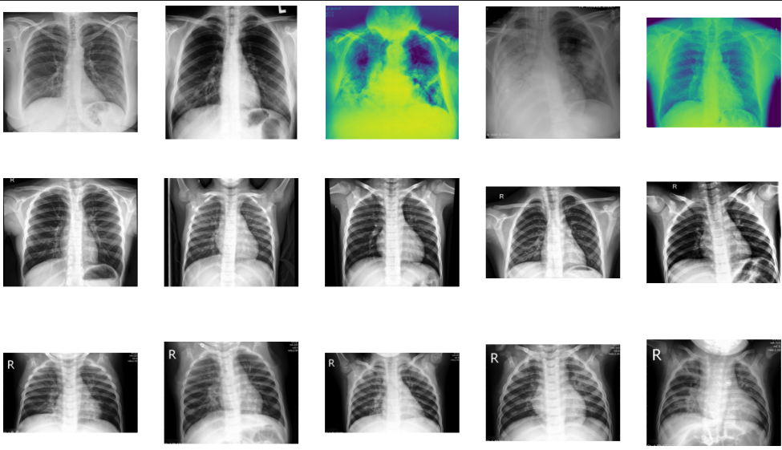

# Disease Detection Model Using Convolutional Neural Network (CNN)

## Background
On December 31, 2019, China reported cases of pneumonia caused by a mysterious virus, later named Novel Coronavirus. It is believed that the virus originated from a seafood market in Wuhan, Hubei, China, mutated, and spread to humans. Its transmission escalated rapidly, and this single-stranded RNA virus was soon found not only in China but in various parts of the world. On February 11, 2020, the World Health Organization (WHO) renamed the Novel Coronavirus as Severe Acute Respiratory Syndrome Coronavirus-2 (SARS-CoV-2) and the disease as Coronavirus Disease 2019 (COVID-19). On March 11, 2020, WHO declared COVID-19 a global pandemic.

In Indonesia, since the first case was publicly announced on March 2, 2020, various policies have been implemented. Large-Scale Social Restrictions (PSBB) and the New Normal movement were enacted to prevent and control the spread of COVID-19 while restoring aspects of daily life that had been disrupted. Public awareness campaigns emphasized sanitation protocols: maintaining physical distance, wearing masks, washing hands, avoiding crowds, and limiting mobility. Vaccination efforts were also developed, promoted, and mandated to reduce COVID-19 mortality rates. However, these measures did not immediately lead to a drastic decline in deaths. Due to the virus's ease of transmission—through airborne droplets and contaminated surfaces—SARS-CoV-2 spread rapidly, with an incubation period of just 1-14 days.

To determine whether an individual is infected with COVID-19, the following assessments are conducted:

Identifying recent contact with confirmed COVID-19 patients.

Observing symptoms such as fever, cough, fatigue, headache, muscle pain, sore throat, nasal congestion, loss of appetite, nausea/vomiting, diarrhea, altered consciousness, anosmia, and ageusia.

Conducting laboratory tests, including rapid tests and Reverse Transcript – Polymerase Chain Reaction (RT-PCR), with RT-PCR being the most recommended.

Performing radiological examinations through chest X-rays or Computerized Tomography (CT) scans. X-rays are used in the early stages, and if abnormalities suggestive of COVID-19 are detected, radiologists diagnose bilateral pneumonia. CT scans are performed if X-ray results are inconclusive.

Conducting peripheral blood tests to monitor other clinical symptoms.

Some clinicians argue that laboratory tests (RT-PCR) are sufficient to determine a COVID-19 diagnosis. However, RT-PCR's sensitivity in detecting the COVID-19 virus ranges from 60%-80%, increasing to 90% only after two tests. Thus, radiological examinations are recommended to enhance diagnostic accuracy. Lee (2020) supports this, stating that CT scans improve COVID-19 diagnosis, making them essential alongside RT-PCR, which has a false-negative rate.

The diagnostic process for pneumonia is similar to that of COVID-19, as COVID-19 is a form of viral pneumonia. Pneumonia symptoms—cough, sputum changes, high fever, bronchial breath sounds, and increased leukocytes—closely resemble COVID-19 symptoms. Pneumonia radiology examinations are relatively straightforward since bacterial pneumonia, such as that caused by Streptococcus pneumoniae, Pseudomonas aeruginosa, and Mycoplasma pneumoniae, has a typical radiological pattern. Therefore, chest X-rays are the primary diagnostic tool, followed by laboratory tests.

The time required for CT scan or X-ray interpretation by radiologists varies. If the findings are typical, interpretation may take hours; if atypical (not patterned) or suspected of severe clinical abnormalities, it may take days. Rapid interpretation is essential in emergency cases. During a pandemic, radiologists must quickly diagnose patients. Early-stage COVID-19 incubation (0-2 days) often shows minimal clinical abnormalities on radiology scans, necessitating repeated imaging to monitor progression. This is also necessary to confirm recovery, as viral traces can persist in radiology results even after symptoms subside. However, repeated radiological examinations should be minimized due to radiation exposure risks and high costs.

These challenges highlight the need for a Disease Detection Model using a Convolutional Neural Network (CNN). This model processes radiology results, specifically CT scans, which capture images at 0.5-1 millimeter thickness. A single CT scan session can generate dozens to hundreds of images (slices) from various angles (axial and sagittal). The large number of CT scan slices aids the model in recognizing patterns, improving classification accuracy.

In hospital workflows, radiographers process CT scan images before presenting them to radiologists, who analyze slice-by-slice images for abnormalities, adjust brightness, and select slices for further examination, particularly in the chest cavity to diagnose pneumonia. Typically, only slices that clearly depict clinical abnormalities are printed. The CNN-based Disease Detection Model assists in confirming diagnoses and accelerates the interpretation process.

## Objectives and Benefits

The Disease Detection Model using CNN aims to assist radiologists in confirming diagnoses from CT scan results rather than replacing them. The model analyzes each image and classifies it based on learned patterns (deep learning), categorizing cases as normal, pneumonia, or COVID-19. This leads to more efficient diagnosis, enabling timely and appropriate treatment decisions, ultimately improving patient recovery rates.

The benefits of this model include its potential as an innovative tool for Indonesia's COVID-19 response. Healthcare professionals can adhere to health protocols by maintaining physical distance and limiting mobility, reducing their exposure risk. Additionally, the model's accessibility via electronic devices enhances remote diagnosis capabilities.

## Limitations

The Disease Detection Model using CNN is limited to classifying CT scan images into three categories: normal, pneumonia, and COVID-19. The CNN model is trained exclusively on these three conditions and cannot detect other clinical abnormalities. However, future developments could expand the model's capabilities to include additional disease classifications.

## Development Methodology
This research utilizes Computer Vision, a subset of Artificial Intelligence (AI), employing Deep Learning techniques. Computer Vision mimics human vision by combining sensory image formation (human sensory system) and machine perception (human cognitive system). The sensory system involves sensors such as cameras, drones, and radar, while the cognitive system leverages Machine Learning. Deep Learning is chosen due to its proven effectiveness in processing non-tabular data, such as images, making it ideal for image classification tasks.

The model development follows six stages: dataset preparation, dataset exploration, data preprocessing, training, validation, and initial testing. The dataset is sourced from Kaggle’s Large COVID-19 CT Scan Slice Dataset, provided by Maeda Maftouni, a Ph.D. candidate at Virginia Tech. This dataset is selected for its credibility, clear documentation, and citation of seven publicly available datasets. Given the challenges of accessing large, high-quality datasets in Indonesia, we chose this dataset for its accuracy and accessibility.

The dataset consists of:
- 7,593 COVID-19 images from 466 patients,
- 6,893 normal images from 604 patients,
- 2,618 pneumonia (CAP) images from 60 patients.

Due to computational limitations, we did not use the entire dataset. Training image classification models requires high-performance processors and GPUs. Based on our prior experience, a dataset of 1,600-4,800 images yields satisfactory model performance. Thus, we used 2,100 images per category, distributed as follows:
- 1,600 images for training,
- 400 images for validation,
- 100 images for initial testing.

**Dataset :**

## Conclusion

**Gambaran Hasil Uji Coba Prediksi :**

### 1. Label Community-Acquired Pneumonia (CAP)

### 2. Label Covid-19

### 3. Label Normal

This project went through multiple stages, from dataset preparation to prediction testing. It leveraged Transfer Learning to enhance the performance of the Machine Learning model, as observed from the performance comparison before and after applying Transfer Learning. In the final stage, predictions were made using three images from each category.

Overall, the model demonstrated strong performance, achieving training and validation accuracy rates **exceeding 95%** and **92%**, respectively, despite some differences between training and validation accuracy. This model provides an additional diagnostic tool alongside direct laboratory examinations, enhancing the efficiency and effectiveness of disease detection. However, periodic monitoring and further development remain necessary, as no model can achieve 100% accuracy.

